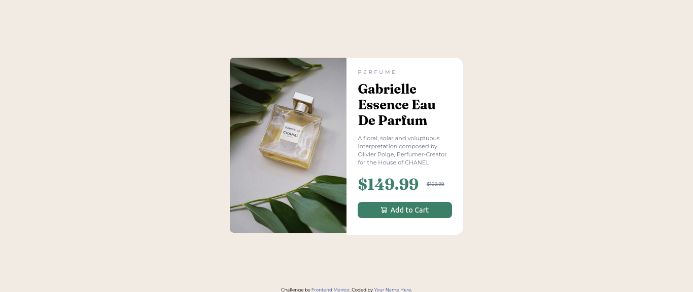

# Frontend Mentor - Product preview card component solution

This is my solution to the [Product preview card component challenge on Frontend Mentor](https://www.frontendmentor.io/challenges/product-preview-card-component-GO7UmttRfa). This challenge helped me practice responsive layouts and improve my HTML and CSS structure.

### The challenge

Users should be able to:

- View the component optimally on mobile and desktop
- See hover and focus states for interactive elements

### Screenshot

#### Desktop

#### Mobile

### Links

- Solution URL: [Your solution on Frontend Mentor](https://www.frontendmentor.io/solutions/your-solution-link)
- Live Site URL: [Live site](https://your-live-site-url.com)

## My process

### Built with

- Semantic HTML5
- CSS custom properties
- Flexbox
- Mobile-first workflow

### What I learned

This project helped reinforce my understanding of:

- Responsive design using media queries
- How to use the `<picture>` tag for responsive images
- Creating clean, maintainable utility classes
- Using `flex-basis` and `gap` effectively with Flexbox
